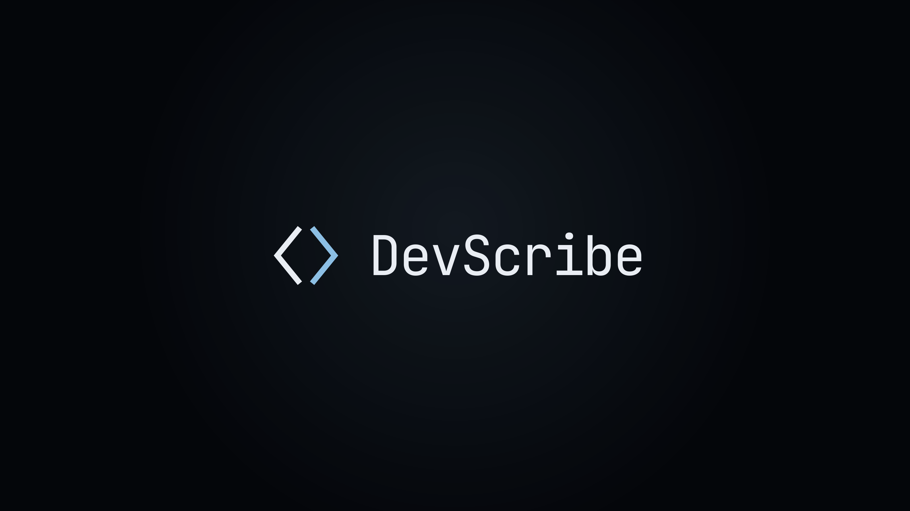
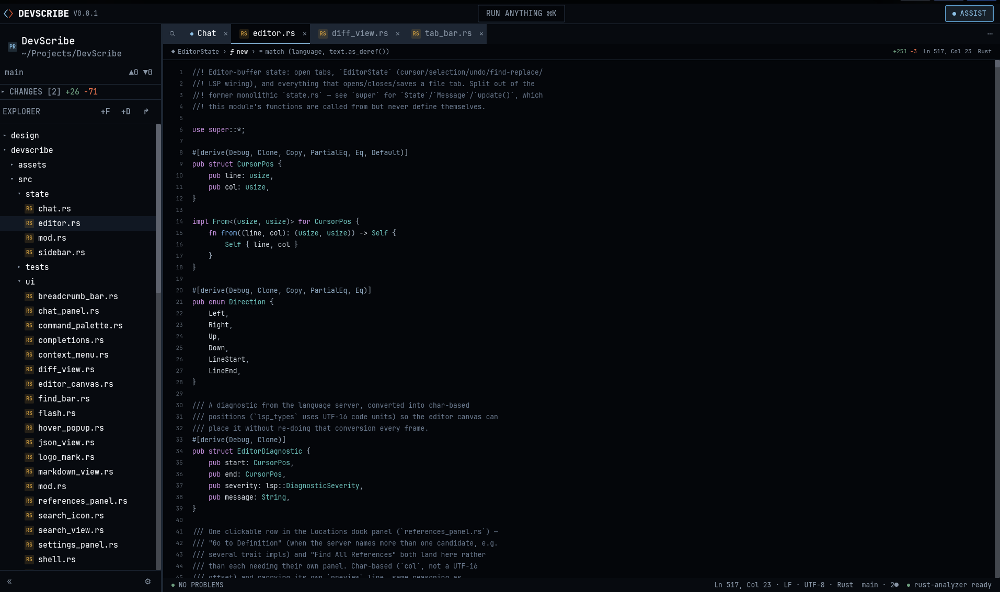
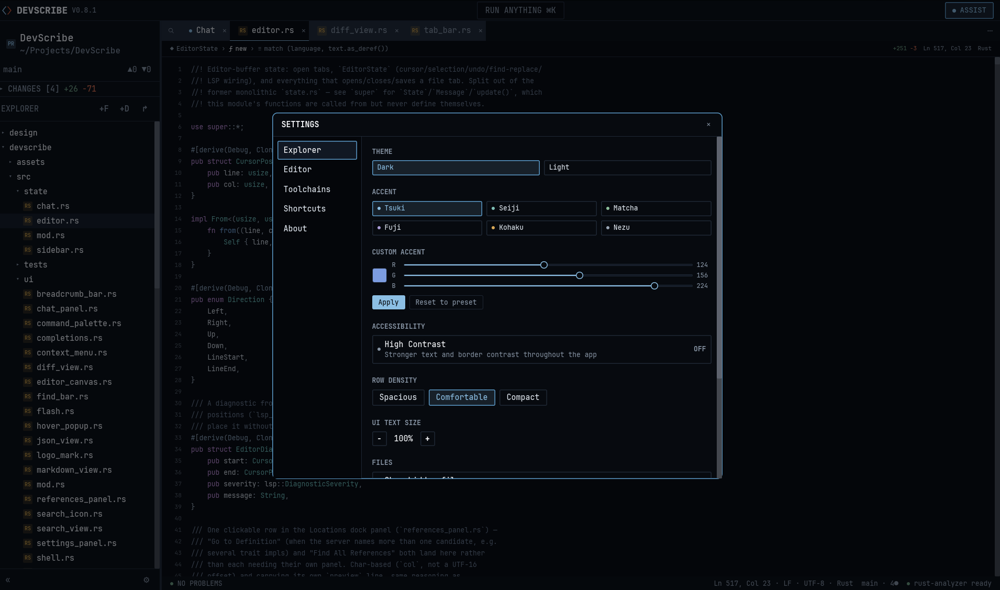
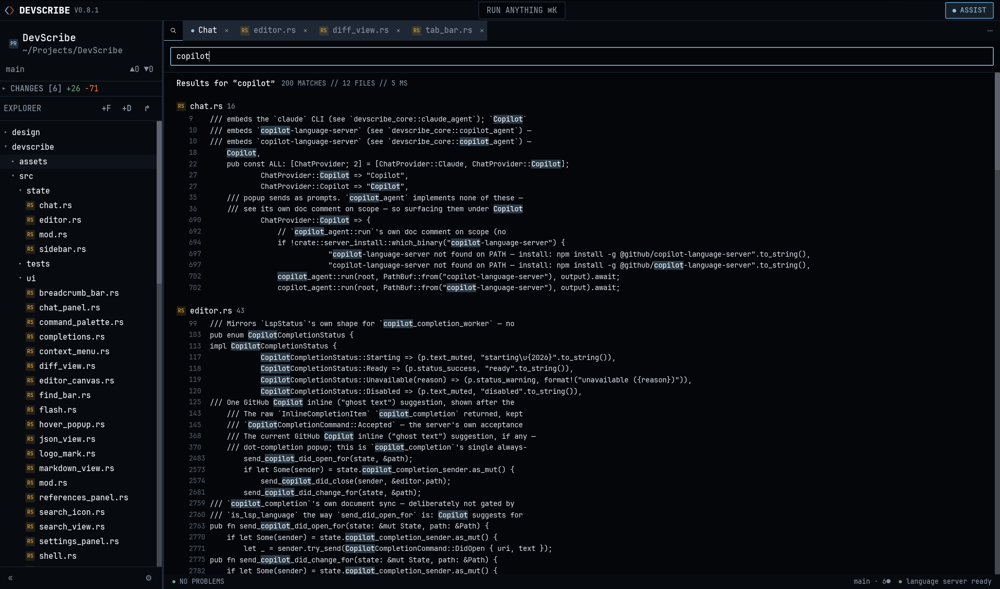

# DevScribe

A "lightweight" code editor fully built in Rust.

The design for this code editor was designed in Claude design. For coding I only use Claude Code.

I always wanted to build my own code editor but never had the courage to start from scratch and never really had a clear design in my head. Now after trying out Claude design I commanded it to create a design for a code editor, and after a few modifications I started to have the mood to start the implementation. I use Claude Code mostly, but a few times it doesn't give the most optimal solution and I had many bugs to fix, and still have. Please join the development if you would like.

You can read the implemented features here: [Features](docs/features.md)
