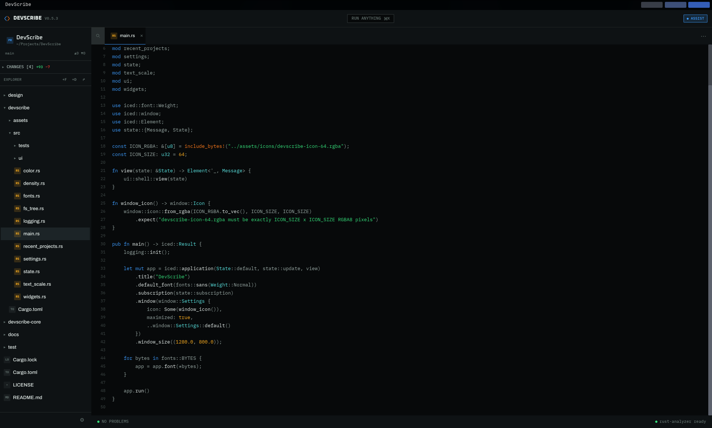
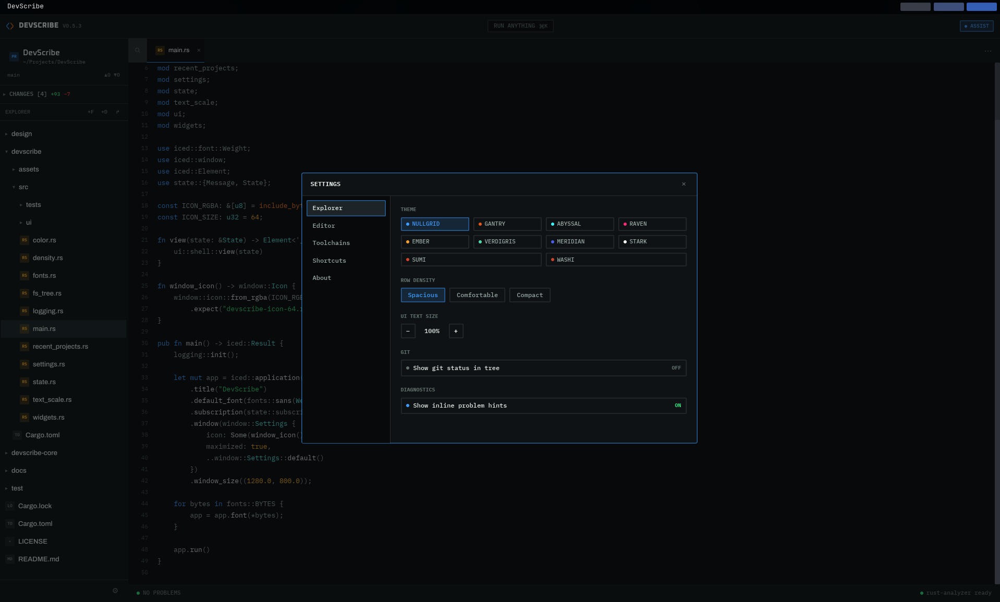

#  DevScribe

A "lightweight" code editor fully bult in Rust.

The design for this code editor was designed in Claude design. For coding I only use claude code.

Pls check out the roadmap. [Roadmap](docs/roadmap.md)

I always wanted to build my own code editor but never had to courage to start from scratch and never really had a clear design in my head. Now after trying out claude design I commanded it to create a design for a code editor and after a few modification I started to have the mood to start the implementation. I use claude code mostly but a few times it doesn't give the most optimal solution and I had many bugs to fix it and still have. Pls join to the development if you would like.